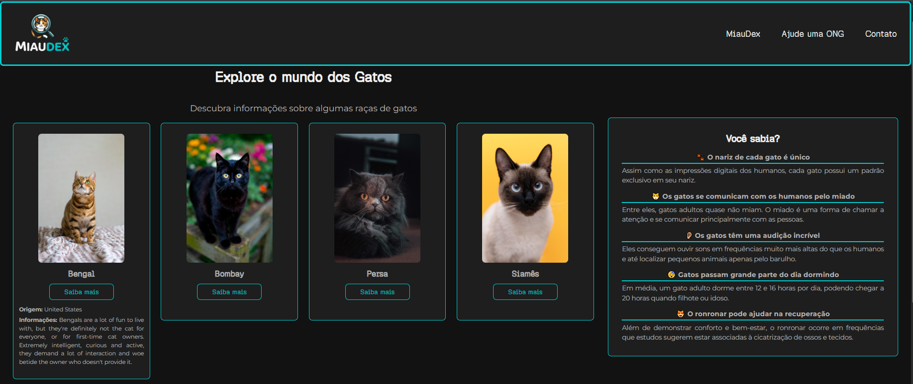

# 🐱 MiauDex

MiauDex é uma aplicação web inspirada na Pokédex, desenvolvida para apresentar informações sobre diferentes raças de gatos de forma interativa. O projeto consome dados da TheCatAPI para exibir informações como origem e descrição das raças, enquanto utiliza imagens armazenadas localmente para manter uma identidade visual consistente.

## 🚀 Tecnologias

- HTML5
- CSS3
- JavaScript (ES6+)
- Web Components
- TheCatAPI
- Git e GitHub

## ✨ Funcionalidades

- Listagem de diferentes raças de gatos.
- Exibição de informações detalhadas sobre cada raça.
- Consumo de dados da TheCatAPI.
- Formulário de contato com confirmação em JavaScript.
- Página com indicação de ONGs para adoção de gatos.
- Interface responsiva.

## 📷 Preview

## 🌐 Acesse o projeto

- **GitHub Pages:**

## 👨‍💻 Autor

Desenvolvido por **Rafael Euclydes**.
